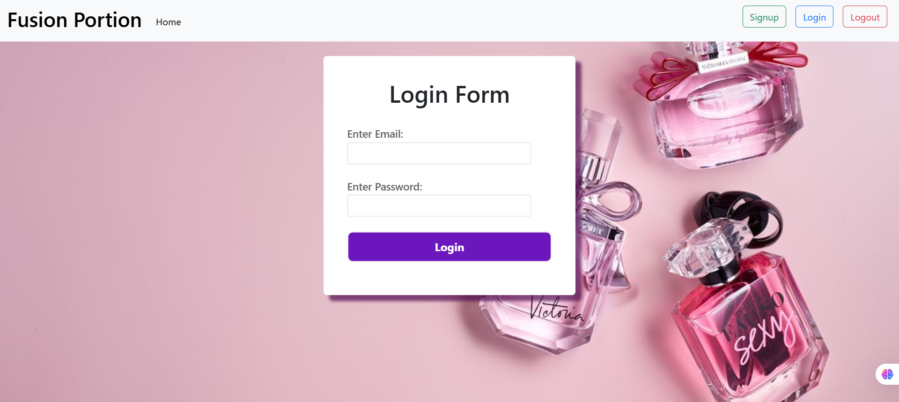

# Task 2: Login and Signup System using PHP and MySQL

## Overview

Fusion Portion is a simple web-based authentication system that allows users to register, log in, and log out securely. It features a responsive design with a visually appealing user interface for an enhanced user experience.

## Features

- User Registration (Signup)
- User Login & Authentication
- Logout Functionality
- Responsive Design
- Navigation Bar for Easy Access
- Welcome Page with Dashboard

## Technologies Used

- **Frontend:** HTML, CSS, Bootstrap
- **Backend:** PHP
- **Database:** MySQL
- **Server:** XAMPP (Apache, MySQL, PHP)

## Project Structure

```
Task 2/
│── Images/               # Contains project images and assets
│── connection.php        # Database connection script
│── index.php            # Home page
│── login.php            # User login page
│── logout.php           # Logout functionality
│── navbar.php           # Navigation bar
│── signup.php           # User signup page
│── style.css            # Custom CSS styling
│── welcome.php          # User dashboard
│── README.md            # Project documentation
```

## Installation & Setup

1. **Clone the repository**

   ```bash
   git clone https://github.com/harshikab2112/Main-Flow-Services-And-Technologies-Internship-Tasks.git
   ```

2. **Move to the project directory**

   ```bash
   cd Main-Flow-Services-And-Technologies-Internship-Tasks/Task 2
   ```

3. **Set up the database**

   - Open **phpMyAdmin** ([http://localhost/phpmyadmin](http://localhost/phpmyadmin))
   - Create a new database (e.g., `fusion_portion`)
   - Import the provided **database.sql** file

4. **Configure the database connection**

   - Open `connection.php`
   - Update the database credentials as needed:
     ```php
     $host = 'localhost';
     $username = 'root';
     $password = '';
     $database = 'db';
     ```

5. **Start XAMPP and run the project**

   - Start **Apache** and **MySQL** from the XAMPP Control Panel
   - Open a browser and go to:
     ```
     http://localhost/Task%202/index.php
     ```

## Future Enhancements

- Password hashing for better security
- Email verification during signup
- Password reset functionality
- Improved UI with animations

## Screenshots

Here are some screenshots of the project:

### Main Page


### Login Page


### Signup Page


### Welcome Dashboard


### Go to dashboard or Log-out page


## License

This project is open-source and available under the [MIT License](LICENSE).

---

Made with ❤️ by Harshika Bansal
