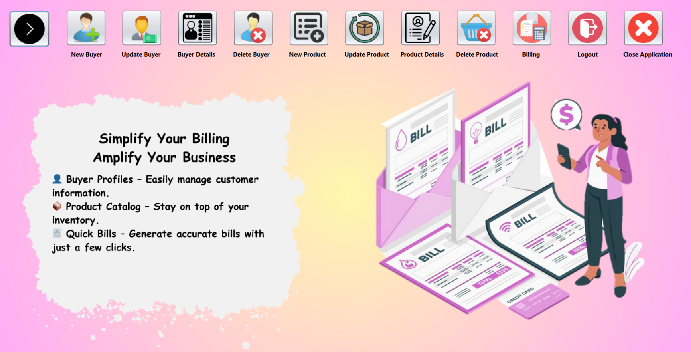
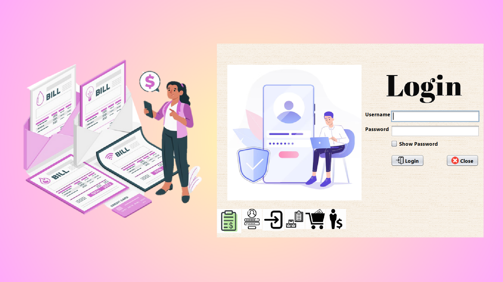

# Task 4 - : Connect to MySQL Database and Design the Homepage in NetBeans ID

This project demonstrates a basic Java Swing application with a homepage interface designed using **NetBeans IDE** and integrated with a **MySQL database**. The application includes a toggleable navigation menu (sidebar buttons) and establishes a connection to a local MySQL database.

## 🔧 Technologies Used

- Java (Swing for GUI)
- MySQL Database
- NetBeans IDE
- JDBC (Java Database Connectivity)

---

## 📌 Features

- ✅ Designed GUI using Java Swing in NetBeans
- ✅ Toggle visibility of sidebar navigation buttons using a `hide` button
- ✅ Connected to a MySQL database using JDBC
- ✅ Exception handling for database and UI interaction

---

## 🖼️ Homepage Design Overview

- Sidebar includes buttons for:
  - New Buyer
  - Update Buyer
  - Buyer Details
  - Delete Buyer
  - New Product
  - Update Product
  - Product Details
  - Delete Product
  - Billing
  - Logout
  - Close Application

- The **`hide` button** toggles visibility of all the sidebar buttons.

---

## 🛠️ How to Run the Project

1. **Clone or Download** the repository.
2. Open the project in **NetBeans IDE**.
3. Set up a MySQL database and configure the JDBC URL.
4. Click the Hide button to toggle the sidebar buttons.

## 📸 Screenshots

## 🙋‍♀️ Author
Avnish Kumar Singh

