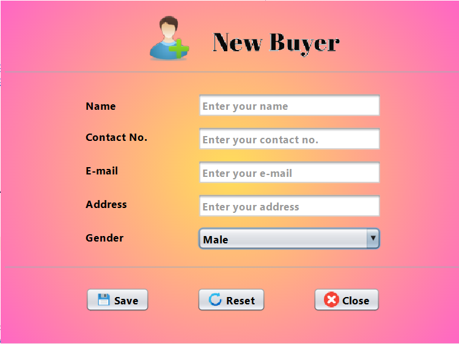
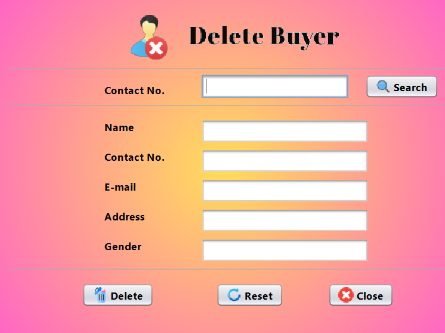
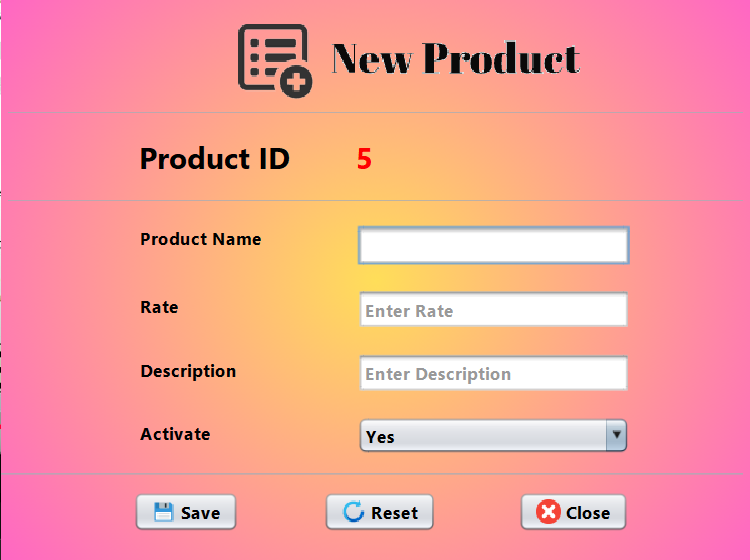
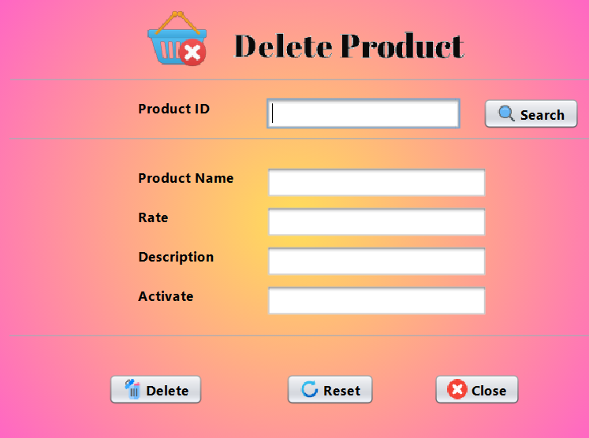

# 🛍️ Task 5: Add and Delete Products/Buyer

This project demonstrates how to **add** and **delete** **Buyers** and **Products** using a **Java Swing GUI** designed in **NetBeans IDE**, connected to a **MySQL database** using **JDBC**.

---

## 🔧 Technologies Used
- Java (Swing for GUI)
- MySQL Database
- NetBeans IDE
- JDBC (Java Database Connectivity)

---

## 📌 Features
- ✅ Add new Buyer to the database
- ✅ Delete existing Buyer from the database
- ✅ Add new Product to the database
- ✅ Delete existing Product from the database
- ✅ Connect Java application to MySQL using JDBC
- ✅ Handle exceptions during database operations

---

## 🛠️ How to Run the Project
1. Clone or Download the repository.
2. Open the project in **NetBeans IDE**.
3. Set up your **MySQL database**:
   - Create the required tables for Buyers and Products.
   - Update your JDBC connection details (username, password, database URL) in the project.
4. Build and run the project.
5. Use the forms to **Add** or **Delete** Buyers and Products.

---

## 📸 Screenshots

---

## 🙋‍♀️ Author
**Avnish Kumar Singh**

