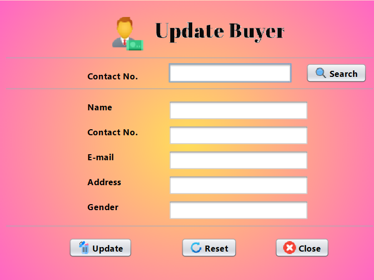
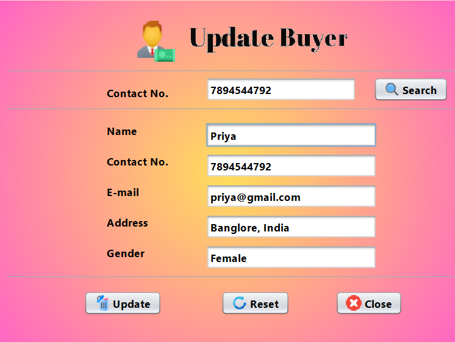
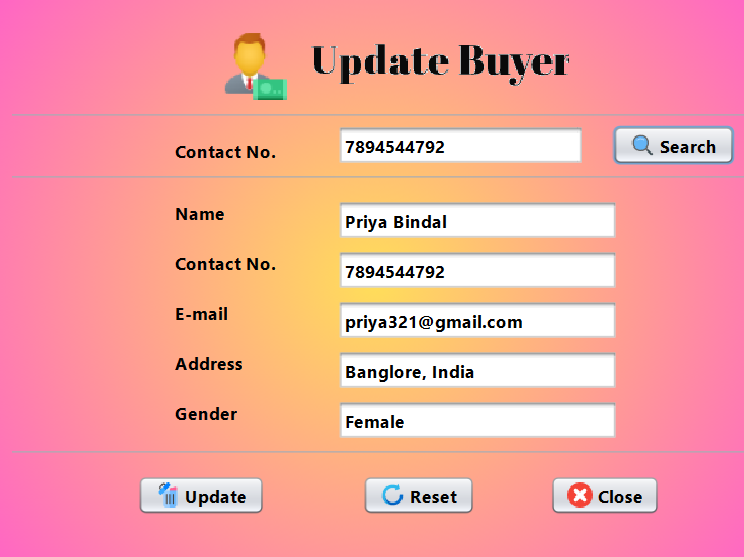
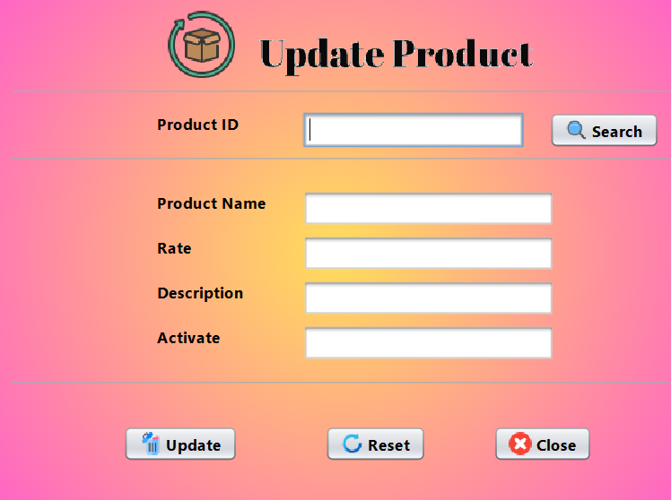
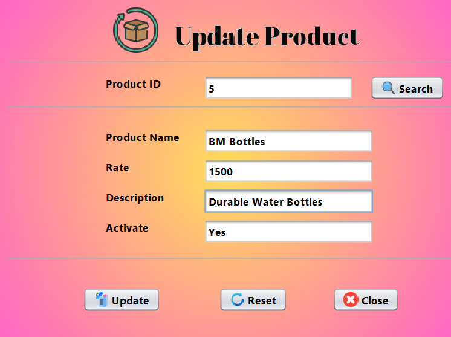
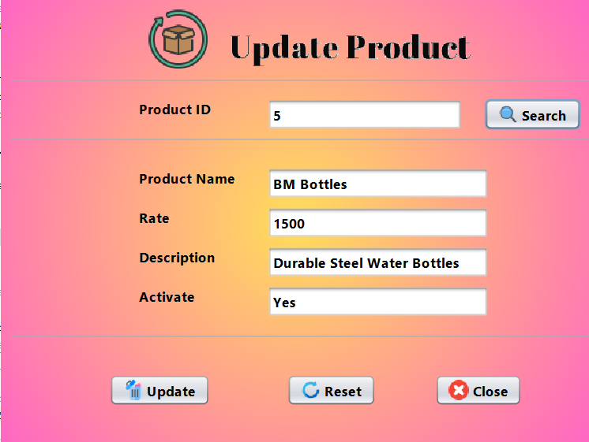

# 🛍️ Task 6: Update and Search Products/Buyers

This project demonstrates how to **search** and **update** **Buyers** and **Products** using a **Java Swing GUI** designed in **NetBeans IDE**, connected to a **MySQL database** using **JDBC**.  
**Note:** The Search and Update functionalities are combined on the **same page** for a smoother workflow.

---

## 🔧 Technologies Used
- Java (Swing for GUI)
- MySQL Database
- NetBeans IDE
- JDBC (Java Database Connectivity)

---

## 📌 Features
- ✅ Search Buyer details from the database
- ✅ Update Buyer details in the database
- ✅ Search Product details from the database
- ✅ Update Product details in the database
- ✅ Single page implementation for both Search and Update
- ✅ Connect Java application to MySQL using JDBC
- ✅ Proper exception handling during database operations

---

## 🛠️ How to Run the Project
1. Clone or Download the repository.
2. Open the project in **NetBeans IDE**.
3. Set up your **MySQL database**:
   - Create the necessary tables for Buyers and Products.
   - Insert some sample data for testing search and update functionality.
   - Update the JDBC connection details (username, password, database URL) in the project.
4. Build and run the project.
5. Use the search bar to find a Buyer/Product, modify their details, and update the database instantly.

---

## 📸 Screenshots

---

## 🙋‍♀️ Author
**Avnish Kumar Singh**

