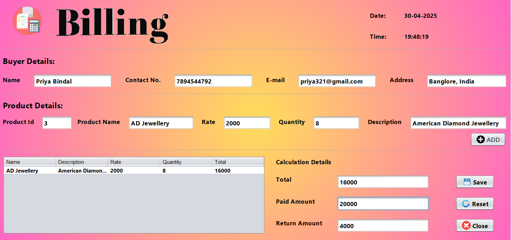
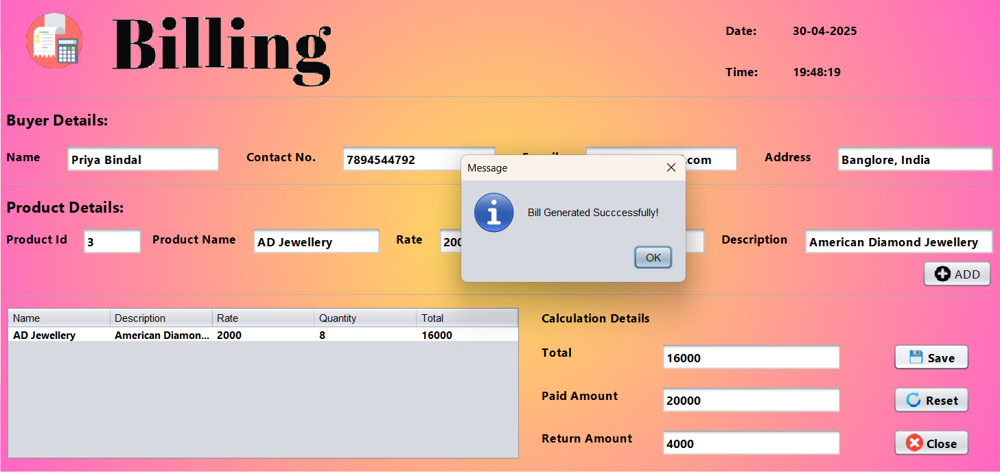
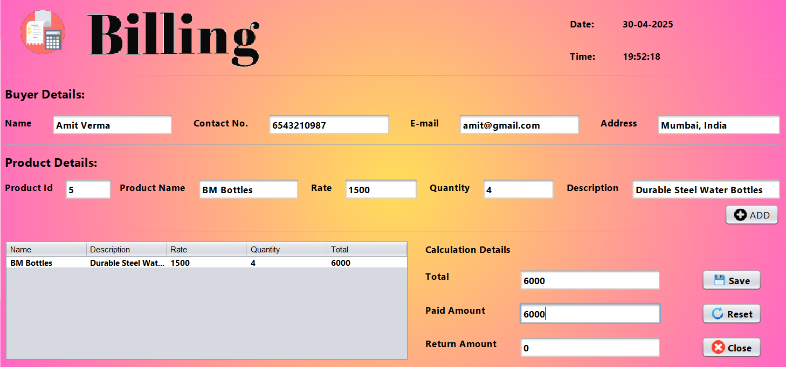
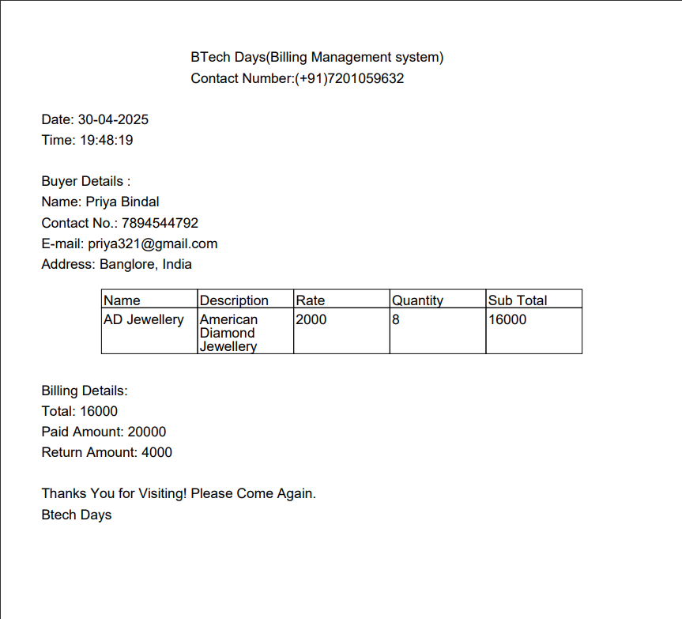
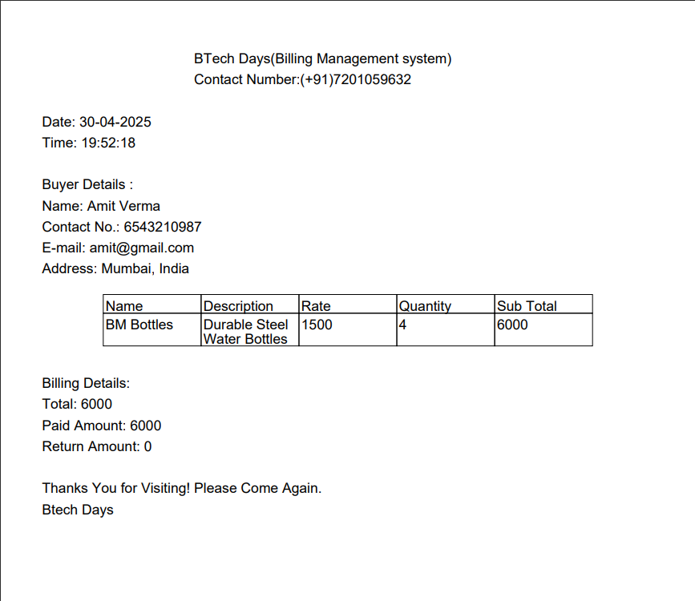
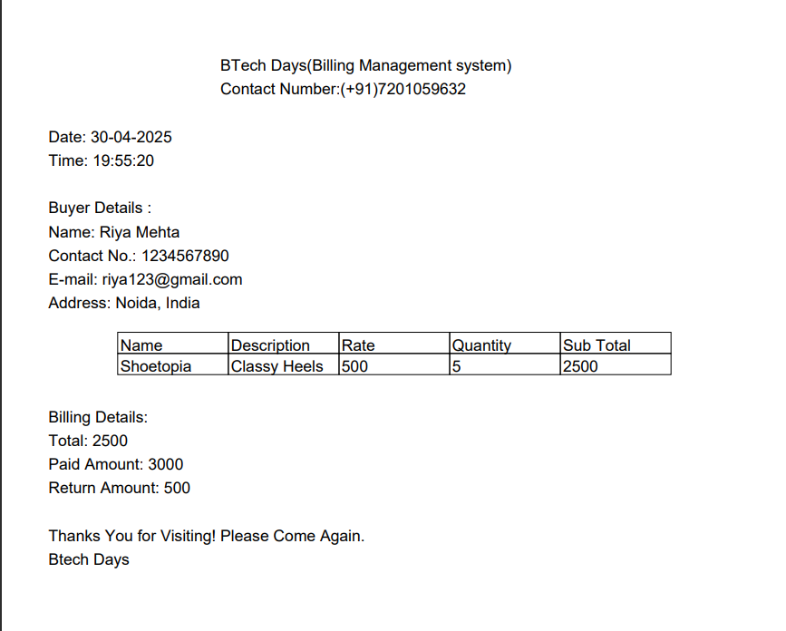

# 🧾 Task 7: Generating the Bill

This project demonstrates how to **generate a customer bill** using a **Java Swing GUI** designed in **NetBeans IDE**, connected to a **MySQL database** using **JDBC**.  
It allows the user to select an existing buyer, choose products and quantities, calculate totals, and generate a formatted bill ready for display or printing.

---

## 🔧 Technologies Used
- Java (Swing for GUI)
- MySQL Database
- NetBeans IDE
- JDBC (Java Database Connectivity)

---

## 📌 Features
- ✅ **Select Buyer** from existing database records  
- ✅ Display Buyer Details (Name, Contact No., E-mail, Address) on the billing form  
- ✅ Search and select Products by Product ID  
- ✅ Automatically fetch product details (Name, Rate, Description)  
- ✅ Enter quantity to calculate item subtotal  
- ✅ Display running **Total**, accept **Paid Amount**, calculate **Return Amount**  
- ✅ Generate a formatted bill with itemized breakdown  
- ✅ Save billing information to the database  
- ✅ Clear/reset billing form for new transactions  

---

## 🛠️ How to Run the Project
1. **Clone** or **Download** the repository.  
2. **Open** the project in **NetBeans IDE**.  
3. **Set up** your **MySQL database**:  
   - Create tables for **Buyers**, **Products**, and **Billing Records**.  
   - Populate **Buyers** and **Products** with sample data.  
   - Update the JDBC connection details (username, password, database URL) in the project code.  
4. **Build** and **Run** the application.  
5. On the billing form:  
   1. **Select Buyer** from the dropdown—Buyer Details will populate automatically.  
   2. **Enter Product ID** and quantity, then click **Add** to add to the bill.  
   3. Review **Total**, enter **Paid Amount**, and see **Return Amount**.  
   4. Click **Save** to store the bill in the database.  

---

## 📸 Screenshot

 

---

## 🙋‍♀️ Author
**Avnish Kumar Singh**

