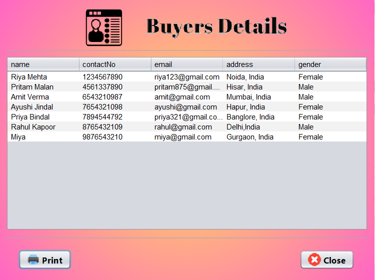
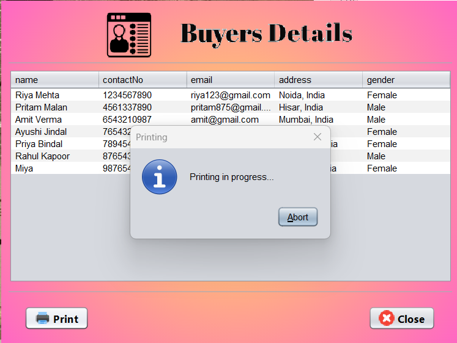
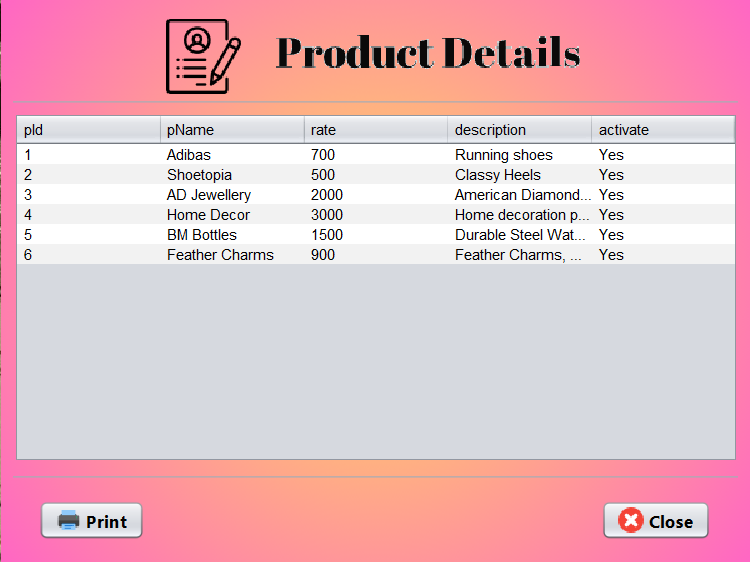
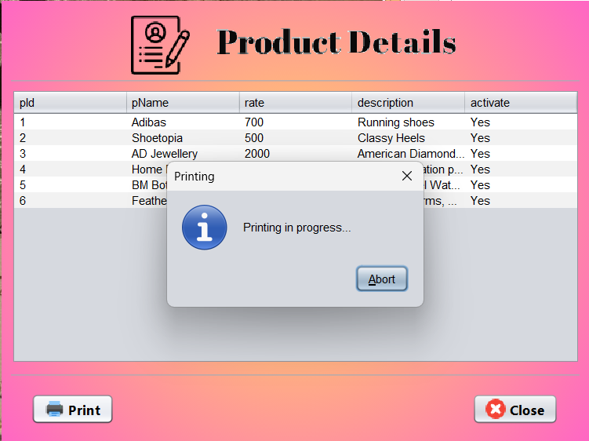
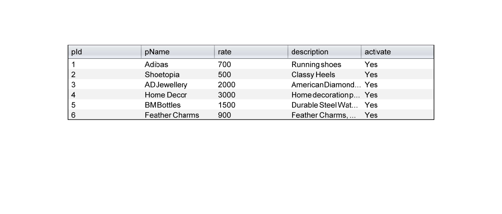
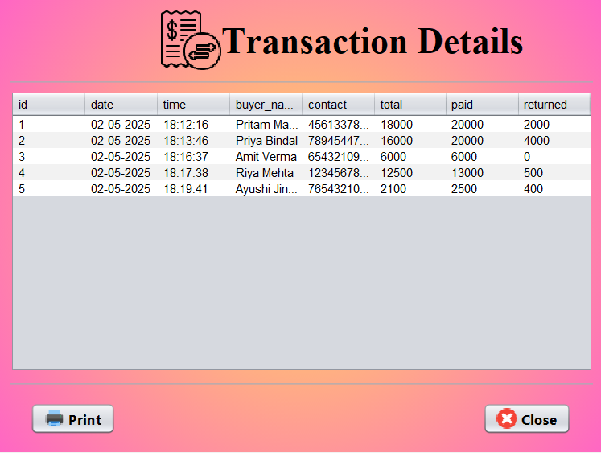
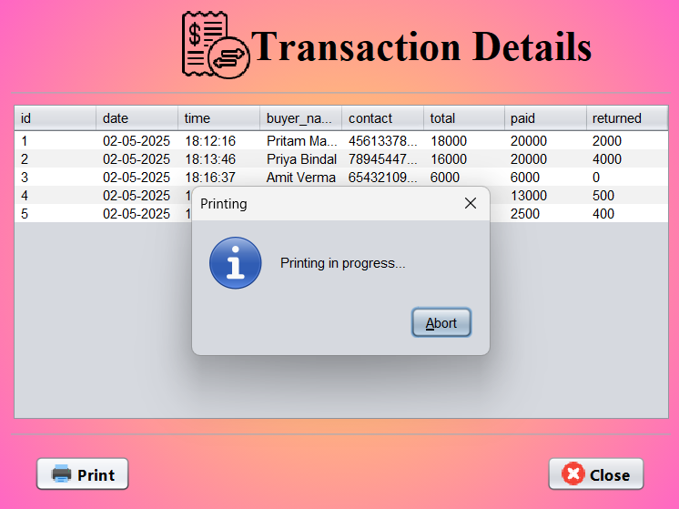
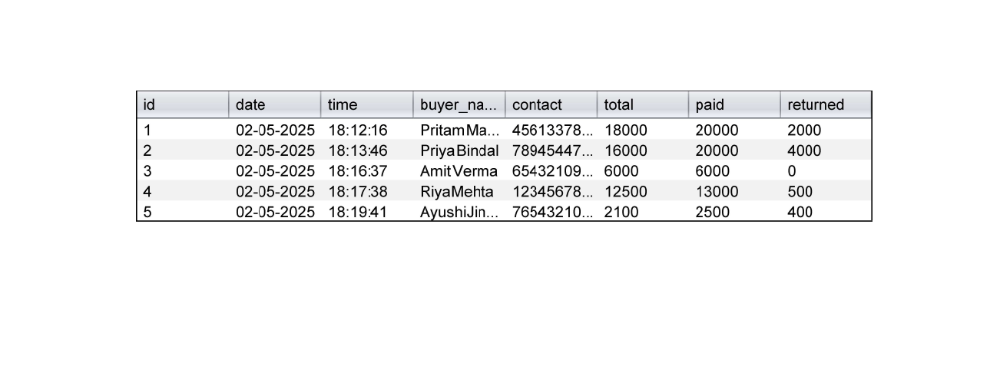

# 📋 Task 8: Viewing Details of Buyers, Products, and Transactions

This project demonstrates how to **view detailed information** about **Buyers**, **Products**, and **Billing Transactions** using a **Java Swing GUI** built in **NetBeans IDE**, connected to a **MySQL database** via **JDBC**.

Users can navigate through different sections to retrieve and display complete lists of records stored in the database, making data management simple and efficient.

---

## 🔧 Technologies Used
- Java (Swing for GUI)
- MySQL Database
- NetBeans IDE
- JDBC (Java Database Connectivity)

---

## 📌 Features
- ✅ View full list of **Buyers** with details like Name, Contact, Email, and Address  
- ✅ View all **Products** with details such as Name, Rate, Description, and Activation Status  
- ✅ View complete **Billing Transactions**, including Bill Number, Buyer Info, Total, and Date  
- ✅ All data fetched dynamically from MySQL using **JDBC**  
- ✅ Display data in **JTables** for clean tabular format  
- ✅ GUI organized with simple navigation for each section

---

## 🛠️ How to Run the Project
1. **Clone** or **Download** the repository.  
2. Open the project in **NetBeans IDE**.  
3. Set up your **MySQL database** with the necessary tables:  
   - `buyers`, `products`, `bills` (or equivalent)  
4. Insert sample data into each table for testing.  
5. Update JDBC connection settings (username, password, database URL) in the project code.  
6. Build and run the application.  
7. Navigate to:
   - **Buyer Details** to view all buyer records  
   - **Product Details** to view all products  
   - **Transaction Details** to view past billing records  

---

## 📸 Screenshots

---

## 🙋‍♀️ Author
**Avnish Kumar Singh**

